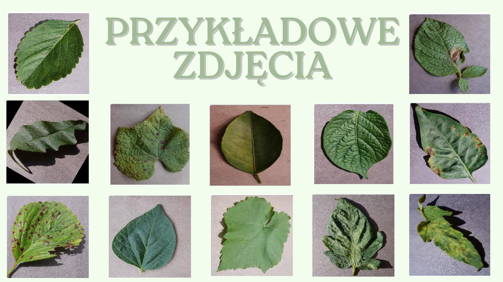

# Rozpoznawanie chorób roślin

Projekt grupowy z automatycznej analizy obrazu.

**Źródło danych:** [New Plant Diseases Dataset](https://www.kaggle.com/datasets/vipoooool/new-plant-diseases-dataset)

Ten zbiór danych składa się z około 87 tys. obrazów RGB zdrowych i chorych liści roślin uprawnych, podzielonych na 38 klas.

**Celem projektu** jest automatyczne rozpoznawanie stanu zdrowia liści na podstawie obrazu.

## **Zadania:**

 1. Opracować **Custom CNN**
 2. Wykorzystać **Transfer Learning** (EfficientNet-B0 lub ResNet-50 z wagami ImageNet) z fine-tuningiem głowy klasyfikacyjnej.
 3. Porównać modele pod kątem:
  - **Metryk klasyfikacji**: Top-1/Top-5 accuracy, precision, recall, F1-score [KaggleScienceDirect](https://www.sciencedirect.com/science/article/abs/pii/S1574954120301321?utm_source=chatgpt.com).
 - **Wydajności**: średni czas inferencji (≥ 10 pomiarów) i rozmiar pliku modelu.

### **Wymagania funkcjonalne**

  **Przygotowanie danych**

 - **Import i podział**: wczytanie obrazów i etykiet; dane są już podzielone
 - **Pre-processing**: resize do 224×224 px, normalizacja pikseli (0–1)
 - **Augmentacja**: losowe obroty, przesunięcia, flip poziomy, zmiana jasności/kontrastu

 1. **Custom CNN**
 2. **Transfer Learning**
       - Base: EfficientNet-B0/ResNet-50 (wagami ImageNet), zamrożone warstwy dolne.
       - **Classification head**: GlobalAveragePooling → Dropout(0.5) → Dense(38) → Softmax
       - Strategia treningu:
        1. Trening głowy przy zamrożonych wagach.
        2. Fine-tuning ostatnich bloków (10–20 % warstw).

